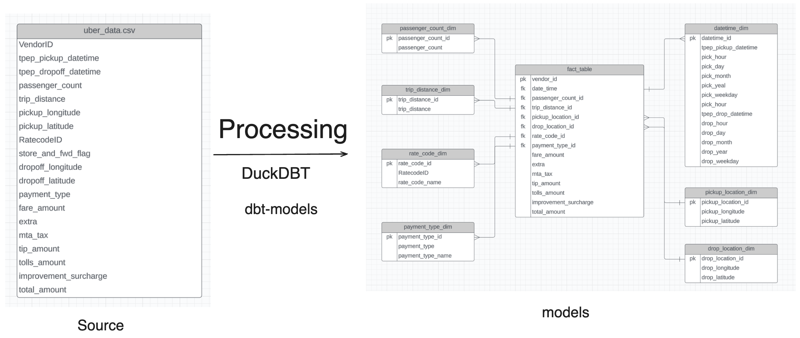

# Uber Data Engineering Project

## Overview

### Tecnologias principais

- duckdb
- dbt-core
- AWS

## Escopo

- [X] Realizar a ingestão dos dados no Amazon S3 em formato .CSV
- [ ] Realizar as transformações dos dados
- [ ] Salvar os dados transformados no Amazon S3
- [ ] Consumir os dados em um dashboard

## Tasks

- [X] Implementar primeiro teste de check de tabelas
- [X] Criar import com duckdb: [Literatura](https://duckdb.org/docs/guides/import/s3_import) 
- [X] Criar um modelo com duckdb
- [X] Criar um model com dbt-core + duckdb: [Literatura](https://docs.getdbt.com/docs/core/connect-data-platform/duckdb-setup)
- [ ] Criar um model e salvar essa tabela no s3 com dbt-core + duckdb 